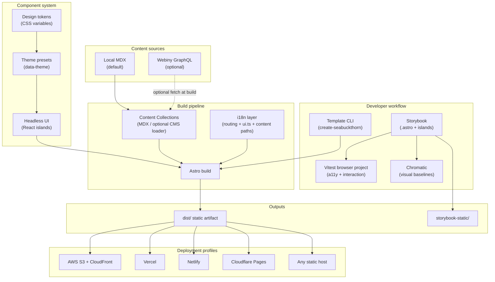
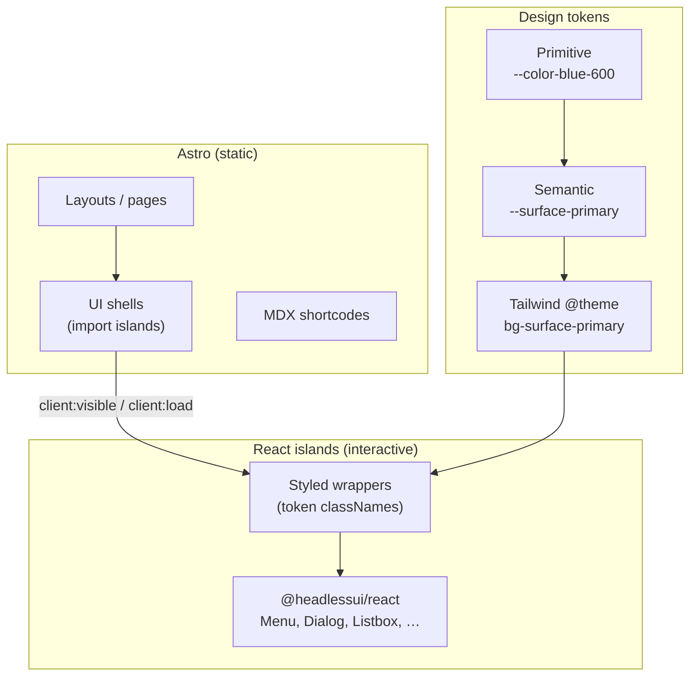
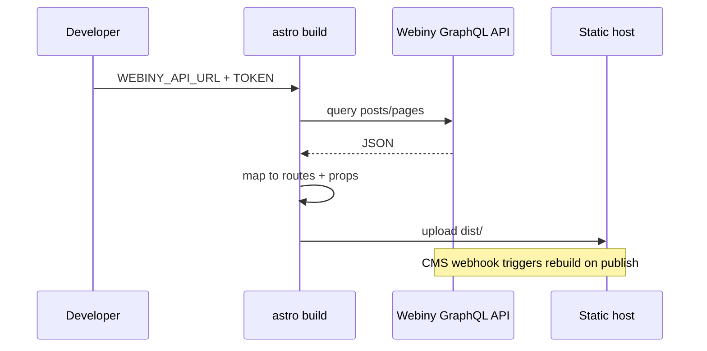
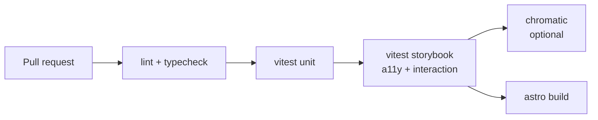

# Seabuckthorn — Project Template Architecture (Draft)

**Status:** Draft v0.2  
**Last updated:** 2026-05-30  
**Purpose:** Define the architecture for a production-oriented Astro project template with built-in i18n, accessibility, Headless UI + multi-theme design tokens, Storybook/Chromatic, optional Webiny CMS, MDX-first content, multi-target static deployment, and accessibility-first component testing.

---

## 1. Goals and principles

### Goals

| Goal | Success criteria |
|------|------------------|
| Fast, accessible marketing/content sites | WCAG 2.2 AA as default target; a11y failures block CI for opted-in stories |
| International by default | Locale-aware URLs, UI strings, and content paths from day one |
| Component quality | Every design-system component has Storybook stories; visual + a11y tests in CI |
| Content flexibility | MDX + Content Collections without external services; Webiny when teams need a CMS |
| Deploy anywhere static | Single `dist/` artifact; optional adapters for platform-specific features |
| Multi-theme UI | Same Headless UI components render correctly under light, dark, brand, and high-contrast themes |
| Low ceremony for authors | Sensible defaults; advanced options behind flags at scaffold time |

### Design principles

1. **Static-first** — Default `output: "static"`. SSR/hybrid only when a deployment profile or CMS mode requires it.
2. **Progressive complexity** — MDX collections work out of the box; Webiny is an optional integration layer, not a fork.
3. **Test at the component boundary** — Accessibility and visual regression live in Storybook; E2E is a thin, optional layer.
4. **Convention over configuration** — One blessed path per concern; escape hatches documented, not advertised.
5. **Template, not framework** — Generated repos are owned by consumers; the generator stays thin (CLI + config presets).
6. **Behavior vs. presentation** — [Headless UI](https://headlessui.com) owns interaction and ARIA; CSS design tokens own color, type, and density. Themes swap tokens, not component code.

### Non-goals (v1)

- Multi-tenant CMS hosting or managed Webiny provisioning
- Runtime i18n (edge KV, CMS-driven locale lists) beyond build-time configuration
- Full design-system product (ship primitives + patterns, not 50 components)
- Native mobile apps or non-web targets

---

## 2. High-level architecture



**Runtime model:** Almost all pages are pre-rendered at build time. Optional Webiny content is fetched during `astro build` (SSG) or via webhook-triggered rebuilds. No CMS runtime dependency in the default profile.

---

## 3. Technology choices

| Layer | Choice | Rationale |
|-------|--------|-----------|
| Framework | **Astro 5.x** (track 6.x when stable) | Static-first, content collections, official i18n routing API |
| Package manager | **pnpm** | Workspace-friendly; matches common Astro ecosystem practice |
| Styling | **Tailwind CSS v4** (Vite plugin) | Utility layer mapped to semantic design tokens |
| Interactive UI | **Headless UI** (`@headlessui/react`) via **`@astrojs/react`** islands | Unstyled, WAI-ARIA–aware primitives; official Tailwind ecosystem fit |
| Headless + Tailwind bridge | **`@headlessui/tailwindcss`** | Style via `ui-*` data-attribute utilities instead of ad-hoc selectors |
| Theming | **CSS custom properties** (design tokens) + `data-theme` on `<html>` | Swap palettes without forking components; supports dark / brand / a11y themes |
| Content (default) | **Content Collections + `@astrojs/mdx`** | Build-time validation (Zod), MDX components for rich content |
| Content (optional) | **Webiny Headless CMS** (GraphQL) | Documented pattern; API key + build-time fetch + deploy webhooks |
| i18n routing | **Astro built-in `i18n` config** + **official `ui.ts` recipe** | Routing/locale detection is native; strings stay in typed dictionaries |
| i18n content | **Per-locale collection paths** (`blog/en/`, `blog/fr/`) | Aligns with Astro i18n recipe; works with static output |
| Site a11y | **Semantic HTML, skip links, focus styles, `lang`**, reduced-motion/contrast tokens | Astro layouts for static chrome; tokens for contrast-safe palettes |
| Component a11y (interactive) | **Headless UI** + axe in Storybook | Keyboard, focus trap, and ARIA patterns built into primitives |
| Component a11y (static) | Thin **`.astro` shells** (skip links, landmarks, prose) | Zero-JS where possible; no duplicate behavior in Astro and React |
| Storybook | **`storybook-astro` (community)** on **Storybook 10** | Renders `.astro` via Container API; supports islands |
| Visual testing | **`@chromatic-com/storybook`** + **Chromatic CI** | Official Storybook path; PR checks on story snapshots |
| A11y testing | **`@storybook/addon-a11y`** (axe-core) + **Vitest addon** (`parameters.a11y.test: 'error'`) | Fails CI on violations; same stories as visual tests |
| Lint a11y | **`eslint-plugin-jsx-a11y`** (for MDX/islands) + **`astro-eslint-parser`** | Catch issues before Storybook |
| E2E (optional) | **Playwright** + **@axe-core/playwright** | Page-level smoke; not the primary a11y gate |

**Risks:**

| Risk | Mitigation |
|------|------------|
| `storybook-astro` is community-maintained | Pin versions; smoke-test on Astro minors |
| Headless UI compound components need a single React tree | One `.tsx` file per primitive (Menu, Dialog, …); Astro pages import the island only |
| Theme regressions across palettes | Chromatic matrix over `globals.theme`; contrast checks per theme in a11y CI |

---

## 4. Component system, Headless UI, and theming

### 4.1 Split of responsibilities



| Layer | Technology | Responsibility |
|-------|------------|----------------|
| **Behavior** | Headless UI | Open/close, focus management, roving tabindex, `aria-*` |
| **Presentation** | Tailwind + semantic tokens | Color, spacing, typography, radius, shadows |
| **Composition (pages)** | Astro | Static markup, content, i18n chrome, island boundaries |
| **Composition (widgets)** | React `.tsx` | Entire Headless UI compound tree in one file |

Headless UI ships **unstyled** components from the Tailwind team; all visual variance lives in token-backed class names, not in Headless UI configuration. That is what allows many themes to share one set of `Button`, `Menu`, and `Dialog` implementations.

### 4.2 Astro + React island pattern

Interactive primitives **must** live in a single React module because Astro islands do not share React context across separate island boundaries ([Astro roadmap #742](https://github.com/withastro/roadmap/discussions/742)).

**Rules:**

1. **One island file per Headless UI compound component** — e.g. `DropdownMenu.tsx` contains `Menu`, `MenuButton`, `MenuItems`, and `MenuItem` together.
2. **Astro never splits Headless UI children** across multiple islands on the same page.
3. **Default hydration:** `client:visible` for menus/dialogs; `client:load` only when needed above the fold.
4. **Props from Astro** — pass serializable props (labels, `items`, `variant`) into the island; keep state inside React.

Example boundary:

```astro
---
// src/components/ui/Dropdown.astro
import { DropdownMenu } from "./react/DropdownMenu";
const { label, items } = Astro.props;
---
<DropdownMenu client:visible label={label} items={items} />
```

Template ships **`@astrojs/react`** by default (not Vue). Optional `--ui-framework=vue` could swap to `@headlessui/vue` in a future template variant; v1 standardizes on React for one Storybook renderer path.

### 4.3 Design token architecture (multi-theme)

Three-tier token model, implemented as CSS variables and consumed by Tailwind v4:

| Tier | Example | Purpose |
|------|---------|---------|
| **Primitive** | `--color-slate-900`, `--space-4` | Raw palette; rarely used in components |
| **Semantic** | `--surface-primary`, `--text-muted`, `--focus-ring` | Meaningful roles; components reference these |
| **Component** (optional) | `--button-bg`, `--menu-item-bg` | Overrides for complex widgets; alias to semantic |

**Theme switching** — no rebuild required for runtime user preference:

```css
/* src/styles/themes/base.css */
:root,
[data-theme="light"] {
  --surface-primary: #ffffff;
  --text-primary: #0f172a;
  --focus-ring: #2563eb;
}

[data-theme="dark"] {
  --surface-primary: #0f172a;
  --text-primary: #f8fafc;
  --focus-ring: #60a5fa;
}

[data-theme="high-contrast"] {
  --surface-primary: #000000;
  --text-primary: #ffffff;
  --focus-ring: #ffff00;
}

/* Brand themes: data-theme="brand-acme", etc. */
```

```css
/* src/styles/global.css — Tailwind v4 @theme maps semantics */
@theme {
  --color-surface-primary: var(--surface-primary);
  --color-text-primary: var(--text-primary);
  --color-focus-ring: var(--focus-ring);
}
```

**`ThemeProvider` island** — small React (or vanilla script) widget that:

- Reads `localStorage.theme` and `prefers-color-scheme`
- Sets `document.documentElement.dataset.theme`
- Syncs with Headless UI `Switch` / `RadioGroup` where used for theme picker

Scaffold includes **3 built-in themes:** `light`, `dark`, `high-contrast`. Additional brand themes are new CSS files + one line in `seabuckthorn.config.ts` `themes[]`.

### 4.4 Styling Headless UI with tokens

Use **`@headlessui/tailwindcss`** so state is expressed with utilities bound to `data-*` attributes:

```tsx
// excerpt — DropdownMenu.tsx
import { Menu, MenuButton, MenuItem, MenuItems } from "@headlessui/react";

<MenuItems
  className={[
    "bg-surface-primary text-text-primary shadow-md rounded-md",
    "origin-top transition data-closed:scale-95 data-closed:opacity-0",
  ].join(" ")}
>
  <MenuItem className="ui-active:bg-surface-secondary ui-focus-visible:outline-focus-ring">
    …
  </MenuItem>
</MenuItems>
```

**Do not** hardcode hex values in components. **Do** use semantic Tailwind utilities (`bg-surface-primary`, `text-text-muted`) backed by CSS variables.

### 4.5 Component inventory (template starter set)

| Component | Headless UI primitive | Notes |
|-----------|----------------------|--------|
| Button | — (native `<button>`) | Styled with tokens; variants via `cva` or Tailwind |
| Dialog / Modal | `Dialog` | Focus trap, `aria-modal` |
| Disclosure / Accordion | `Disclosure` | For FAQ patterns |
| Dropdown / Nav menu | `Menu` | Site nav, language picker |
| Select | `Listbox` | Forms (prefer native `<select>` when styling allows) |
| Tabs | `Tab` | In-page sections |
| Switch | `Switch` | Theme toggle, settings |
| Popover | `Popover` | Tooltips with interactive content |

Static patterns (card grid, hero, prose) remain **`.astro`** with no client JS.

### 4.6 Storybook and Chromatic implications

- **Dual renderers:** `@storybook/react` for `src/components/ui/react/**`; `storybook-astro` for static `.astro` shells and layouts.
- **Theme decorator** in `.storybook/preview.ts`:

```ts
export const globalTypes = {
  theme: {
    toolbar: {
      items: ["light", "dark", "high-contrast", "brand-acme"],
    },
  },
};

export const decorators = [
  (Story, context) => {
    document.documentElement.dataset.theme = context.globals.theme ?? "light";
    return Story();
  },
];
```

- **Chromatic:** run visual tests per theme (matrix or dedicated stories `Button/Dark`, `Button/HighContrast`) so token regressions are caught.
- **A11y CI:** run axe under **each default theme** for interactive stories (contrast rules are theme-dependent).

### 4.7 Dependencies (default stack)

```bash
pnpm add @headlessui/react @headlessui/tailwindcss react react-dom
pnpm add -D @astrojs/react
npx astro add react
```

---

## 5. Repository layout (generated project)

```
.
├── .github/workflows/          # ci.yml, chromatic.yml, deploy-*.yml
├── .storybook/                 # main.ts, preview.ts, vitest setup
├── docs/                       # contributor + a11y guidelines
├── public/
├── src/
│   ├── components/
│   │   ├── ui/
│   │   │   ├── react/          # Headless UI + styled wrappers (islands)
│   │   │   └── *.astro         # thin shells importing islands
│   │   └── content/            # MDX shortcodes (Callout, Figure, …)
│   ├── content/
│   │   ├── pages/              # marketing MDX (optional)
│   │   └── blog/               # {locale}/**/*.{md,mdx}
│   ├── content.config.ts       # collection schemas + loaders
│   ├── i18n/
│   │   ├── ui.ts               # UI string tables
│   │   ├── utils.ts            # getLangFromUrl, useTranslations, …
│   │   └── routes.ts           # optional slug translation map
│   ├── integrations/
│   │   └── webiny/             # optional: client, types, loaders
│   ├── layouts/
│   │   ├── Base.astro          # lang, skip link, landmarks
│   │   └── Article.astro
│   ├── pages/
│   │   ├── index.astro         # redirect to default locale
│   │   └── [locale]/           # or split en/ fr/ per routing mode
│   └── styles/
│       ├── global.css          # Tailwind + @theme token map
│       └── themes/             # light.css, dark.css, brand-*.css
├── astro.config.mjs
├── chromatic.config.json
├── vitest.config.ts            # storybook browser project
├── seabuckthorn.config.ts      # template feature flags (see §11)
└── deploy/                     # host-specific assets (not duplicated logic)
    ├── vercel.json
    ├── netlify.toml
    ├── cloudflare/
    └── aws/                    # s3 sync + invalidation example
```

---

## 6. Internationalization (i18n)

### 6.1 Two complementary layers

Astro’s built-in i18n handles **URLs and locale detection**, not copy translation ([Astro i18n docs](https://docs.astro.build/en/guides/internationalization/)).

| Layer | Responsibility | Implementation |
|-------|----------------|----------------|
| **Routing** | Prefixes, default locale, fallbacks, `hreflang` | `astro.config.mjs` → `i18n: { locales, defaultLocale, routing }` |
| **UI strings** | Nav, buttons, aria labels for chrome | `src/i18n/ui.ts` + `useTranslations()` ([official recipe](https://docs.astro.build/en/recipes/i18n/)) |
| **Content** | Blog/docs per language | Content collection with `glob` loader: `**/{locale}/**/*.{md,mdx}` or `id` prefix `en/post-1` |
| **SEO** | Alternate links | `getAbsoluteLocaleUrlList()` + layout `<link rel="alternate" hreflang="…">` |

### 6.2 Default routing profile

```js
// astro.config.mjs (illustrative)
i18n: {
  locales: ["en", "fr", "de"],
  defaultLocale: "en",
  routing: {
    prefixDefaultLocale: false,  // /about vs /fr/about
    redirectToDefaultLocale: true,
  },
  fallback: {
    fr: "en",
  },
},
```

Template scaffolds **either**:

- **Prefix mode** — all locales under `/[locale]/…` (simpler mental model), or  
- **Hidden default** — default locale at root (recipe’s `showDefaultLang: false`).

CLI flag: `--i18n-routing=prefix|hidden-default`.

### 6.3 RTL and advanced routing

- Document RTL via `dir` on `<html>` driven by locale metadata in `ui.ts`.
- Defer **experimental `advancedRouting` / `src/app.ts`** until a consumer needs custom middleware; mention in “Phase 2”.

### 6.4 When to add Paraglide / i18next

Stay on `ui.ts` until >3 locales or ICU/plural rules are required. Optional integration path in docs, not in default template.

---

## 7. Accessibility (a11y)

### 7.1 Site-level (Astro pages)

| Concern | Approach |
|---------|----------|
| Document language | `<html lang={lang} dir={dir}>` from `getLangFromUrl` |
| Landmarks | One `<main>`, logical `<header>` / `<footer>` / `<nav>` |
| Skip navigation | `<SkipLinks />` component in `Base.astro` |
| Focus | Visible `:focus-visible`; no `outline: none` without replacement |
| Motion | `prefers-reduced-motion` CSS; optional toggle synced with launcher pattern |
| Images | Required `alt` in content schema; decorative `alt: ""` |
| Color | Document contrast tokens; optional `@incluud` color checker in dev |
| Forms | Headless UI `Listbox` / native controls; labels + `aria-describedby` for errors |
| Interactive widgets | Headless UI primitives (focus trap, keyboard) — do not reimplement in Astro |

### 7.2 Authoring and CI gates

| Stage | Tool | Gate |
|-------|------|------|
| Edit time | ESLint jsx-a11y | Warn in dev, error in CI |
| Component | Storybook a11y addon | `parameters.a11y.test: 'error'` on `ui/**/*` stories |
| Component CI | `npx vitest --project=storybook` | Fail PR on axe violations; **per theme** for token-sensitive stories |
| Visual | Chromatic | UI regressions per `globals.theme` (contrast/layout) |
| Release (optional) | Playwright + axe on 3–5 critical URLs | Smoke only |

### 7.3 Story requirements (template policy)

Every **interactive** component under `src/components/ui/react/` must include:

1. **Default story** — typical usage  
2. **States story** — disabled, loading, error where applicable  
3. **Keyboard story** — interaction tests via `play()` when behavior is non-trivial  
4. **A11y meta** — `parameters.a11y.test: 'error'` unless explicitly `todo` with linked issue  
5. **Theme coverage** — default + `dark` + `high-contrast` via Storybook `globals.theme` or story variants  

Static `.astro` components follow the same rules where they ship user-facing UI. Document exceptions (e.g. third-party embeds) in story file comments.

---

## 8. Content architecture

### 8.1 Default: MDX content collections

```ts
// src/content.config.ts (illustrative)
import { defineCollection, z } from "astro:content";
import { glob } from "astro/loaders";

const blog = defineCollection({
  loader: glob({
    base: "./src/content/blog",
    pattern: "**/*.{md,mdx}",
  }),
  schema: z.object({
    title: z.string(),
    description: z.string(),
    pubDate: z.coerce.date(),
    locale: z.enum(["en", "fr", "de"]),
    draft: z.boolean().default(false),
    cover: z
      .object({ src: z.string(), alt: z.string() })
      .optional(),
  }),
});
```

- **MDX shortcodes** — map `Callout`, `Figure`, `Video` in `Content` `components` prop.  
- **Drafts** — filter `draft: true` from production builds via loader or `getCollection` filter.  
- **Preview** — optional `output: 'server'` profile for draft preview only (Phase 2).

### 8.2 Optional: Webiny Headless CMS

**Integration pattern** (build-time, static output):



| Piece | Design |
|-------|--------|
| Client | `src/integrations/webiny/client.ts` — `graphql-request` or native `fetch` |
| Types | Generated or hand-maintained from content models |
| Routes | `getStaticPaths` from Webiny list queries (same as [Webiny + Astro tutorial](https://www.webiny.com/blog/build-blog-astro-webiny-headless-cms)) |
| Env | `WEBINY_API_URL`, `WEBINY_API_TOKEN` (never committed) |
| Rebuild | Deploy hook URL per host; Webiny webhook on publish |
| Coexistence | **Either** collection-driven MDX **or** Webiny for a given collection, not both writing the same slug |

CLI flag: `--cms=none|webiny` (default `none`).

**Note:** Webiny is not run locally; consumers use a cloud project per Webiny docs.

### 8.3 Content adapter interface (internal)

Abstract source for testability and future CMS swaps:

```ts
export interface ContentSource<T> {
  list(locale: string): Promise<T[]>;
  getBySlug(locale: string, slug: string): Promise<T | null>;
}
// Implementations: MdxCollectionSource, WebinySource
```

---

## 9. Storybook and Chromatic

### 9.1 Stack

| Package | Role |
|---------|------|
| `storybook` 10.x | Core |
| `storybook-astro` | Framework for `.astro` layout/shell stories |
| `@storybook/react` | Stories for Headless UI components in `ui/react/` |
| `@storybook/addon-a11y` | axe in panel + automated tests |
| `@storybook/addon-vitest` | Browser tests from stories |
| `@chromatic-com/storybook` | Visual test addon + CI project link |

### 9.2 Developer scripts

```json
{
  "dev": "concurrently -n astro,sb \"astro dev\" \"storybook dev -p 6006\"",
  "storybook": "storybook dev -p 6006",
  "build-storybook": "storybook build",
  "test:storybook": "vitest --project=storybook",
  "chromatic": "chromatic --exit-zero-on-changes"
}
```

Optional: `storybook-astro` dev toolbar integration in `astro.config.mjs` (dev only).

### 9.3 Story conventions

- **React / Headless UI:** `Button.stories.tsx` colocated with `ui/react/Button.tsx`.  
- **Astro shells:** `SiteHeader.stories.ts` via `storybook-astro` when documenting static composition.  
- **Themes:** `globals.theme` decorator (see §4.6); Chromatic captures at least light + dark.  
- **Global styles:** import `src/styles/global.css` and all theme CSS in `.storybook/preview.ts`.  
- **Locales:** `globals.locale` decorator for i18n-sensitive components.

### 9.4 Chromatic in CI

- Workflow on PR: `build-storybook` → `npx chromatic --project-token=$CHROMATIC_PROJECT_TOKEN`.  
- **Required check** on `main` for designated teams; template ships as optional with docs.  
- `chromatic.config.json`: `buildScriptName`, `zip: true` for large Storybooks.

### 9.5 Vitest browser configuration (a11y CI)

```ts
// vitest.config.ts (illustrative excerpt)
test: {
  projects: [
    {
      extends: true,
      test: {
        name: "storybook",
        browser: {
          enabled: true,
          provider: "playwright",
          headless: true,
          instances: [{ browser: "chromium" }],
        },
        setupFiles: [".storybook/vitest.setup.ts"],
      },
    },
  ],
},
```

`.storybook/preview.ts` sets default:

```ts
parameters: {
  a11y: {
    test: "error",
    config: { rules: [{ id: "color-contrast", enabled: true }] },
  },
},
```

Per-story overrides for known false positives must include justification comment.

---

## 10. Deployment architecture

### 10.1 Build artifact

Default profile produces **`dist/`** only (`output: "static"`). No adapter installed.

| Setting | Value |
|---------|--------|
| Build command | `pnpm build` |
| Output directory | `dist` |
| Node | 20 LTS |

### 10.2 Deployment profiles (scaffold-time)

CLI: `--deploy=vercel|netlify|cloudflare|aws-s3|static-only`

| Profile | Config added | Notes |
|---------|--------------|-------|
| **static-only** | README deploy section | Upload `dist/` anywhere |
| **vercel** | `@astrojs/vercel` *not* required for static; optional `vercel.json` rewrites | Git connect; env vars in dashboard |
| **netlify** | `netlify.toml` | Build hook for CMS |
| **cloudflare** | `wrangler`/Pages project file | `NODE_VERSION=20` |
| **aws-s3** | `deploy/aws/sync.sh` + CloudFront invalidation example | OIDC role in CI; no adapter |

### 10.3 SSR / hybrid (opt-in)

Document upgrading path:

1. `npx astro add vercel|netlify|cloudflare`  
2. `output: "server"` or `"hybrid"`  
3. Implications for i18n middleware and Webiny preview  

Default template **does not** enable SSR.

### 10.4 CMS rebuild webhooks

Each profile documents:

1. Create deploy hook in host UI  
2. Add URL to Webiny (or other CMS) webhooks  
3. Optional: protect hook with secret header  

---

## 11. Template generator and configuration

### 11.1 Generator tool

**Name (working):** `create-seabuckthorn` — npm package in monorepo or separate repo that copies template + performs string replacement.

**Implementation options:**

| Approach | Pros | Cons |
|----------|------|------|
| **Astro `create-astro` template** | Native ecosystem | Less flexible feature flags |
| **Custom CLI (citty/giget)** | Full flag surface | More maintenance |
| **Turborepo + generators** | Good for org monorepos | Heavier |

**Delivered (P5):** **`create-seabuckthorn`** in `packages/create-seabuckthorn` — copies a template snapshot and applies scaffold transforms (`@clack/prompts`, `ts-morph`). Raw clone without transforms: `pnpm create astro@latest my-site -- --template <org>/seabuckthorn`. See [scaffold.md](scaffold.md).

### 11.2 `seabuckthorn.config.ts` (generated)

Single source of enabled features for docs and conditional imports:

```ts
export default {
  siteName: "My Site",
  locales: ["en", "fr"],
  defaultLocale: "en",
  cms: "none" as "none" | "webiny",
  deploy: "vercel" as "vercel" | "netlify" | "cloudflare" | "aws-s3" | "static-only",
  i18nRouting: "hidden-default" as "prefix" | "hidden-default",
  storybook: true,
  chromatic: false, // user enables after project creation
  themes: ["light", "dark", "high-contrast"] as const,
  defaultTheme: "light" as const,
} as const;
```

### 11.3 Scaffold prompts (initial set)

1. Project name / site URL  
2. Locales (multi-select)  
3. CMS: None / Webiny  
4. Deploy target  
5. Theme presets (multi-select: light, dark, high-contrast, + optional brand name)  
6. Install Storybook assets? (always yes for this template)  
7. Chromatic project token (optional, can add later)  

---

## 12. CI/CD pipeline



| Job | Command | Blocking |
|-----|---------|----------|
| Lint | `pnpm lint` | Yes |
| Typecheck | `pnpm astro check` | Yes |
| Storybook tests | `pnpm test:storybook` | Yes |
| Chromatic | `pnpm chromatic` | Configurable (default: yes if token present) |
| Production build | `pnpm build` | Yes |
| Deploy | Host-specific | `main` only |

**Caching:** pnpm store, Playwright browsers, Storybook build cache.

---

## 13. Security and operations

- **Secrets:** `.env.example` only; Webiny tokens and Chromatic tokens in CI secrets.  
- **Dependencies:** Renovate/Dependabot; monthly Storybook + Astro alignment.  
- **CSP:** Document optional strict CSP for static sites (may affect MDX embeds).  
- **Privacy:** No analytics in template; slot for Plausible/Fathom behind env flag.

---

## 14. Phased delivery

| Phase | Deliverable |
|-------|-------------|
| **P0** | Astro + MDX + i18n + **design tokens** + **Headless UI starter set** (Dialog, Menu, Switch) |
| **P1** | Storybook (React + Astro) + theme toolbar + a11y addon + Vitest browser CI |
| **P2** | Chromatic workflow + docs |
| **P3** | Deploy profile files + AWS S3 example |
| **P4** | Webiny integration package + webhook docs |
| **P5** | `create-seabuckthorn` CLI + reference demo + GitHub Pages deploy |

---

## 15. Open questions

1. **Branding:** Final template name (`seabuckthorn` vs consumer-facing name)?  
2. **Variant API:** `class-variance-authority` (cva) vs plain Tailwind maps for button/card variants?  
3. **Storybook split:** Minimum % of stories in React vs Astro — recommend ≥80% interactive in React?  
4. **i18n default:** Prefix all locales vs hidden default for SEO/marketing preference?  
5. **Monorepo:** Single package vs `apps/docs` + `packages/create-template`?  
6. **License:** MIT for template; third-party notices for axe/Chromatic terms.  
7. **Astro 6:** Target 5.x for stability or 6.x for style sub-modules + advanced routing?  

---

## 16. References

- [Headless UI (React)](https://headlessui.com)  
- [@headlessui/tailwindcss](https://github.com/tailwindlabs/headlessui/tree/main/packages/@headlessui-tailwindcss)  
- [@astrojs/react](https://docs.astro.build/en/guides/integrations-guide/react/)  
- [Astro i18n routing](https://docs.astro.build/en/guides/internationalization/)  
- [Astro i18n recipe (`ui.ts`)](https://docs.astro.build/en/recipes/i18n/)  
- [Astro content collections](https://docs.astro.build/en/guides/content-collections/)  
- [@astrojs/mdx](https://docs.astro.build/en/guides/integrations-guide/mdx/)  
- [Deploy to Netlify / static](https://docs.astro.build/en/guides/deploy/netlify/)  
- [storybook-astro](https://github.com/storybook-astro/storybook-astro)  
- [Storybook accessibility testing](https://storybook.js.org/docs/writing-tests/accessibility-testing)  
- [Chromatic Storybook addon](https://www.chromatic.com/docs/visual-tests-addon/)  
- [Build blog with Astro + Webiny](https://www.webiny.com/blog/build-blog-astro-webiny-headless-cms)  

---

## Appendix A: Example `astro.config.mjs` (combined concerns)

```js
import { defineConfig } from "astro/config";
import mdx from "@astrojs/mdx";
import react from "@astrojs/react";
import sitemap from "@astrojs/sitemap";
import tailwindcss from "@tailwindcss/vite";

export default defineConfig({
  site: "https://example.com",
  output: "static",
  vite: { plugins: [tailwindcss()] },
  integrations: [mdx(), react(), sitemap()],
  i18n: {
    locales: ["en", "fr"],
    defaultLocale: "en",
    routing: { prefixDefaultLocale: false },
  },
});
```

## Appendix B: Decision log

| Date | Decision | Rationale |
|------|----------|-----------|
| 2026-05-30 | MDX collections as default CMS | Zero ops, full git review, type-safe |
| 2026-05-30 | Astro i18n + ui.ts, not i18next | Native routing; avoid extra runtime |
| 2026-05-30 | A11y gate in Storybook Vitest, not only addon panel | Enforces CI failures per requirements |
| 2026-05-30 | Static deploy default | Matches “variety of static hosting” requirement |
| 2026-05-30 | Headless UI + CSS tokens for theming | One component set, many themes; behavior/a11y from Tailwind team primitives |
| 2026-05-30 | React islands for Headless UI only | Compound components need single React tree; Astro stays static elsewhere |
